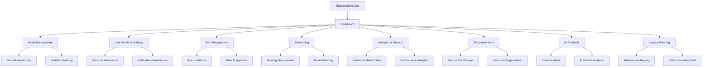

# Privora Wealth Management Platform - Product Requirements Document

## 1. Product Overview

Privora is a comprehensive wealth management platform designed to help individuals and families track, manage, and optimize their financial assets across multiple categories including stocks, real estate, crypto, and other investments. The platform offers tiered subscription plans ranging from free personal use to enterprise-level wealth management with AI-powered analytics and legacy planning capabilities.

The platform addresses the growing need for centralized wealth tracking and management tools, serving individual investors, high-net-worth families, and ultra-wealthy clients who require sophisticated financial planning and inheritance management. Privora aims to democratize wealth management tools while providing premium features for advanced users.

## 2. Core Features

### 2.1 User Roles

| Role | Registration Method | Core Permissions |
|------|---------------------|------------------|
| Owner | Email registration with subscription | Full access to all tier features, account management, billing |
| Manager | Invitation by Owner (Basic+ tiers) | Asset management, reporting, limited settings access |
| Staff | Invitation by Owner/Manager (Basic+ tiers) | View-only access to designated portfolios and reports |
| Guest User | Free tier registration | Personal-only access, manual asset entry, basic dashboard |

### 2.2 Feature Module

Our Privora platform consists of the following main pages organized by subscription tier:

**Free Tier Pages:**
1. **Dashboard**: Net worth overview, basic asset visualization, portfolio summary
2. **Asset Management**: Manual asset entry for stocks, real estate, basic portfolio tracking
3. **User Profile & Settings**: Personal information management, basic preferences

**Basic Tier Additional Pages:**
4. **Staff Management**: User invitation system, role assignment, access control
5. **Scheduling**: Manual meeting and travel planning, calendar integration

**Premium Tier Additional Pages:**
6. **Analytics & Reports**: Real-time market data, performance tracking, monthly reports
7. **Document Vault**: Secure file storage, document organization, sharing controls

**Elite Tier Additional Features:**
- **AI Assistant Integration**: Embedded across all pages for smart analysis and recommendations
- **Legacy Planning Module**: Inheritance mapping, heir management, estate planning tools

### 2.3 Page Details

| Page Name | Module Name | Feature Description |
|-----------|-------------|--------------------|
| Dashboard | Net Worth Overview | Display total portfolio value, asset allocation charts, performance indicators |
| Dashboard | Asset Summary Cards | Show individual asset categories with current values and percentage changes |
| Dashboard | Quick Actions | Provide shortcuts for adding assets, viewing reports, accessing frequently used features |
| Asset Management | Manual Asset Entry | Allow users to input stock holdings, real estate properties, crypto assets with current values |
| Asset Management | Portfolio Tracking | Track asset performance over time, calculate gains/losses, display historical data |
| Asset Management | Asset Categorization | Organize assets by type, risk level, geographic location, custom tags (Basic+ tiers) |
| User Profile & Settings | Personal Information | Manage user details, contact information, profile picture, security settings |
| User Profile & Settings | Notification Preferences | Configure email alerts, system notifications, report delivery settings |
| User Profile & Settings | Privacy Controls | Manage data sharing preferences, account visibility, export/delete data options |
| Staff Management | User Invitation System | Send invitations to staff/managers, set role-based permissions, manage access levels |
| Staff Management | Role Assignment | Define custom roles, assign specific portfolio access, set viewing/editing permissions |
| Staff Management | Activity Monitoring | Track staff actions, view access logs, monitor portfolio changes and updates |
| Scheduling | Meeting Management | Schedule client meetings, set reminders, integrate with calendar systems |
| Scheduling | Travel Planning | Plan business travel, track expenses, coordinate with portfolio management activities |
| Scheduling | Notification System | Send email reminders for meetings, deadlines, important portfolio events |
| Analytics & Reports | Real-time Market Data | Display live crypto and forex rates, stock prices, market trends and analysis |
| Analytics & Reports | Performance Analytics | Generate detailed performance reports, benchmark comparisons, risk analysis |
| Analytics & Reports | Monthly Snapshots | Create automated monthly reports, portfolio summaries, goal tracking progress |
| Document Vault | Secure File Storage | Upload and store financial documents, contracts, certificates with encryption |
| Document Vault | Document Organization | Categorize documents by type, date, relevance, create custom folder structures |
| Document Vault | Sharing Controls | Set document access permissions, share with staff/advisors, track document views |
| AI Assistant | Smart Analysis | Provide AI-powered insights on portfolio performance, market trends, optimization suggestions |
| AI Assistant | Predictive Analytics | Forecast portfolio growth, identify risks, suggest rebalancing strategies |
| AI Assistant | Natural Language Queries | Allow users to ask questions about their portfolio in natural language |
| Legacy Planning | Inheritance Mapping | Create visual inheritance trees, map asset distribution to heirs |
| Legacy Planning | Heir Management | Manage beneficiary information, set inheritance rules, track legal documentation |
| Legacy Planning | Estate Planning Tools | Generate estate planning reports, tax optimization strategies, succession planning |

## 3. Core Process

**Free Tier User Flow:**
Users register with email, access basic dashboard, manually enter assets, view net worth summary, manage personal profile settings.

**Basic Tier User Flow:**
Owner upgrades subscription, invites one manager, assigns asset management permissions, schedules meetings, receives email notifications for important events.

**Premium Tier User Flow:**
Owner adds up to 5 users, accesses real-time market data, uploads documents to secure vault, generates monthly performance reports, uses fitness planner for lifestyle tracking.

**Elite Tier User Flow:**
Owner utilizes AI assistant for portfolio analysis, creates inheritance plans with wealth tree visualizations, accesses real-time chat support, receives predictive analytics and smart recommendations.

## 4. User Interface Design

### 4.1 Design Style

- **Primary Colors**: Deep navy blue (#1a365d) for trust and professionalism, gold accent (#d69e2e) for premium feel
- **Secondary Colors**: Light gray (#f7fafc) for backgrounds, white (#ffffff) for content areas
- **Button Style**: Rounded corners with subtle shadows, gradient effects for premium tiers
- **Font**: Inter or similar modern sans-serif, 16px base size, 14px for secondary text
- **Layout Style**: Card-based design with clean spacing, top navigation with tier-specific styling
- **Icons**: Minimalist line icons with financial themes, gold accents for premium features

### 4.2 Page Design Overview

| Page Name | Module Name | UI Elements |
|-----------|-------------|-------------|
| Dashboard | Net Worth Overview | Large central card with animated number counters, donut charts for allocation, green/red indicators for performance |
| Dashboard | Asset Summary Cards | Grid layout of cards with asset icons, current values, percentage change indicators with color coding |
| Asset Management | Manual Asset Entry | Modal forms with step-by-step input, auto-complete for stock symbols, image upload for real estate |
| Asset Management | Portfolio Tracking | Interactive line charts, filterable tables, export buttons, drag-and-drop reordering |
| Staff Management | User Invitation System | Contact-style interface with role selection dropdowns, permission checkboxes, invitation status indicators |
| Analytics & Reports | Real-time Market Data | Live updating widgets, candlestick charts, news feed integration, customizable watchlists |
| Document Vault | Secure File Storage | Dropzone for file uploads, folder tree navigation, preview thumbnails, security badges |
| AI Assistant | Smart Analysis | Chat interface with financial context, suggestion cards, interactive charts, voice input option |
| Legacy Planning | Inheritance Mapping | Interactive family tree visualization, drag-and-drop asset assignment, timeline views |

### 4.3 Responsiveness

The platform is desktop-first with mobile-adaptive design. Touch interaction optimization is implemented for tablet and mobile devices, with simplified navigation and gesture-based controls for chart interactions. The dashboard automatically adjusts card layouts for smaller screens, and complex tables convert to accordion-style views on mobile devices.

## 5. Detailed Functional Requirements by Tier

### 5.1 Free Tier Functional Requirements

#### 5.1.1 Dashboard & Net Worth Tracking
- **Net Worth Calculation**: Automatically calculate total net worth from manually entered assets
- **Asset Allocation Visualization**: Display pie charts showing percentage allocation across asset categories
- **Performance Indicators**: Show basic gain/loss calculations and percentage changes
- **Quick Asset Overview**: Display summary cards for each major asset category
- **Data Refresh**: Manual refresh capability for updating asset values

#### 5.1.2 Asset Management
- **Manual Stock Entry**: Input stock symbols, quantities, purchase prices, current values
- **Real Estate Tracking**: Enter property details, purchase prices, estimated current values, property types
- **Basic Portfolio View**: List all assets in tabular format with sorting and filtering
- **Asset Categories**: Organize assets into predefined categories (stocks, real estate, cash, other)
- **Historical Tracking**: Store historical values for basic trend analysis

#### 5.1.3 User Profile & Settings
- **Personal Information Management**: Edit name, email, phone, address, profile picture
- **Basic Security Settings**: Change password, enable two-factor authentication
- **Notification Preferences**: Configure email notifications for account activities
- **Data Export**: Export portfolio data in CSV format
- **Account Deletion**: Self-service account deletion with data purge

### 5.2 Basic Tier Functional Requirements ($199/month)

#### 5.2.1 Enhanced Asset Management
- **Asset Tagging System**: Create custom tags for assets, filter and group by tags
- **Advanced Categories**: Create custom asset categories beyond predefined options
- **Bulk Asset Operations**: Import/export assets via CSV, bulk edit capabilities
- **Asset Notes**: Add detailed notes and descriptions to individual assets
- **Cost Basis Tracking**: Track multiple purchase dates and prices for same asset

#### 5.2.2 Staff Management
- **User Invitation System**: Send email invitations to one additional manager
- **Role-Based Access Control**: Assign view/edit permissions for specific asset categories
- **Activity Logging**: Track all user actions and changes to portfolio
- **Permission Management**: Granular control over what staff can view and modify
- **User Status Management**: Activate/deactivate staff access, manage user sessions

#### 5.2.3 Scheduling & Planning
- **Meeting Scheduler**: Create and manage client meetings with calendar integration
- **Travel Planning**: Plan and track business travel related to investments
- **Task Management**: Create and assign tasks related to portfolio management
- **Reminder System**: Set custom reminders for important dates and deadlines
- **Calendar Integration**: Sync with Google Calendar, Outlook, and other calendar systems

#### 5.2.4 Enhanced Notifications
- **Email Reminders**: Automated reminders for meetings, deadlines, portfolio reviews
- **Custom Alert Rules**: Set alerts for significant portfolio value changes
- **Weekly Summaries**: Automated weekly portfolio performance summaries
- **Task Notifications**: Alerts for assigned tasks and approaching deadlines
- **System Announcements**: Important platform updates and feature announcements

### 5.3 Premium Tier Functional Requirements ($499/month)

#### 5.3.1 Real-Time Market Data Integration
- **Live Crypto Tracking**: Real-time cryptocurrency prices and portfolio values
- **Forex Rate Monitoring**: Live foreign exchange rates for international assets
- **Stock Market Integration**: Real-time stock prices and automatic portfolio updates
- **Market News Feed**: Curated financial news relevant to user's portfolio
- **Price Alerts**: Custom alerts for specific price targets and market movements

#### 5.3.2 Enhanced User Access (Up to 5 Users)
- **Multi-User Dashboard**: Separate dashboards for different user roles
- **Collaborative Features**: Shared notes, comments, and portfolio discussions
- **User Activity Tracking**: Detailed logs of all user actions and portfolio changes
- **Advanced Permission Matrix**: Granular permissions for different portfolio sections
- **User Performance Metrics**: Track individual user contributions and activities

#### 5.3.3 Secure Document Vault
- **Encrypted File Storage**: Bank-level encryption for all uploaded documents
- **Document Categories**: Organize documents by type (contracts, certificates, reports)
- **Version Control**: Track document versions and changes over time
- **Sharing Controls**: Share documents with specific users or external parties
- **Document Search**: Full-text search across all uploaded documents
- **Audit Trail**: Complete log of document access and modifications

#### 5.3.4 Advanced Analytics & Reporting
- **Performance Benchmarking**: Compare portfolio performance against market indices
- **Risk Analysis**: Calculate portfolio risk metrics and diversification scores
- **Monthly Automated Reports**: Comprehensive monthly performance and allocation reports
- **Custom Report Builder**: Create custom reports with selected metrics and timeframes
- **Goal Tracking**: Set and track progress toward financial goals
- **Tax Reporting**: Generate tax-related reports and capital gains/losses summaries

#### 5.3.5 Lifestyle Integration
- **Fitness Planner**: Track health and wellness goals alongside financial goals
- **Lifestyle Expense Tracking**: Monitor lifestyle expenses and their impact on wealth
- **Goal Correlation**: Analyze relationships between lifestyle choices and financial performance
- **Wellness Metrics**: Track metrics that may impact long-term financial planning
- **Integration APIs**: Connect with fitness trackers and health monitoring devices

### 5.4 Elite Tier Functional Requirements ($999/month)

#### 5.4.1 AI-Powered Analysis & Smart Assistant
- **Natural Language Queries**: Ask questions about portfolio in plain English
- **Predictive Analytics**: AI-powered forecasts for portfolio performance
- **Smart Rebalancing Suggestions**: AI recommendations for portfolio optimization
- **Risk Assessment**: AI analysis of portfolio risk and diversification
- **Market Sentiment Analysis**: AI interpretation of market trends and news impact
- **Personalized Insights**: Customized recommendations based on user behavior and goals
- **Voice Interface**: Voice commands for portfolio queries and basic operations

#### 5.4.2 Legacy Planning & Inheritance Management
- **Interactive Wealth Tree**: Visual representation of wealth distribution across generations
- **Heir Management System**: Detailed profiles and inheritance allocations for beneficiaries
- **Estate Planning Tools**: Generate estate planning documents and strategies
- **Tax Optimization**: AI-powered strategies for minimizing estate taxes
- **Succession Planning**: Plan business succession and asset transfers
- **Legal Document Integration**: Store and manage wills, trusts, and legal documents
- **Multi-Generational Tracking**: Track wealth across multiple generations

#### 5.4.3 Premium Support Services
- **Real-Time Chat Support**: 24/7 chat support with financial experts
- **Video Consultation Scheduling**: Schedule video calls with wealth management advisors
- **Priority Support Queue**: Expedited support response times
- **Dedicated Account Manager**: Assigned relationship manager for high-value accounts
- **Custom Feature Requests**: Priority consideration for custom feature development
- **White-Glove Onboarding**: Personalized setup and training sessions

#### 5.4.4 Advanced Wealth Management Tools
- **Multi-Currency Support**: Track assets in multiple currencies with automatic conversion
- **Alternative Investment Tracking**: Support for private equity, hedge funds, art, collectibles
- **Trust and Entity Management**: Manage complex ownership structures and entities
- **Regulatory Compliance**: Tools for meeting regulatory reporting requirements
- **Advanced Tax Planning**: Sophisticated tax optimization strategies and modeling
- **Institutional Integration**: Connect with banks, brokerages, and financial institutions

## 6. Non-Functional Requirements

### 6.1 Performance Requirements
- **Page Load Time**: All pages must load within 3 seconds on standard broadband connections
- **Real-Time Data Updates**: Market data updates within 15 seconds of market changes (Premium+ tiers)
- **Concurrent Users**: Support up to 10,000 concurrent users across all tiers
- **Database Response Time**: Database queries must complete within 500ms for 95% of requests
- **File Upload Speed**: Document uploads up to 100MB must complete within 60 seconds

### 6.2 Security Requirements
- **Data Encryption**: AES-256 encryption for all data at rest and in transit
- **Authentication**: Multi-factor authentication required for all tiers
- **Session Management**: Automatic session timeout after 30 minutes of inactivity
- **Access Logging**: Complete audit trail of all user actions and data access
- **Compliance**: SOC 2 Type II compliance for data security and privacy
- **Backup Security**: Encrypted backups with 99.9% recovery guarantee

### 6.3 Scalability Requirements
- **User Growth**: Platform must scale to support 100,000+ users within 2 years
- **Data Storage**: Support for unlimited document storage (Elite tier)
- **Geographic Distribution**: Multi-region deployment for global accessibility
- **Load Balancing**: Automatic load distribution across multiple servers
- **Database Scaling**: Horizontal scaling capability for growing data volumes

### 6.4 Availability Requirements
- **Uptime**: 99.9% uptime guarantee with planned maintenance windows
- **Disaster Recovery**: Complete system recovery within 4 hours of major outage
- **Backup Frequency**: Automated backups every 6 hours with point-in-time recovery
- **Monitoring**: 24/7 system monitoring with automated alerting
- **Maintenance Windows**: Scheduled maintenance during low-usage periods

### 6.5 Usability Requirements
- **Mobile Responsiveness**: Full functionality on tablets and smartphones
- **Browser Compatibility**: Support for Chrome, Firefox, Safari, Edge (latest 2 versions)
- **Accessibility**: WCAG 2.1 AA compliance for users with disabilities
- **User Training**: Built-in tutorials and help documentation
- **Interface Language**: Support for English with plans for additional languages

### 6.6 Integration Requirements
- **API Availability**: RESTful APIs for third-party integrations (Premium+ tiers)
- **Data Import/Export**: Support for common financial data formats (CSV, QIF, OFX)
- **Calendar Integration**: Sync with major calendar applications
- **Bank Connectivity**: Secure connections to major financial institutions (Elite tier)
- **Market Data Feeds**: Integration with reliable market data providers

## 7. Compliance and Regulatory Requirements

### 7.1 Data Privacy
- **GDPR Compliance**: Full compliance with European data protection regulations
- **CCPA Compliance**: California Consumer Privacy Act compliance for US users
- **Data Portability**: Users can export all personal data in standard formats
- **Right to Deletion**: Complete data deletion upon user request
- **Privacy Controls**: Granular privacy settings for data sharing and usage

### 7.2 Financial Regulations
- **Investment Advisor Compliance**: Tools to support registered investment advisors
- **Record Keeping**: Maintain required financial records per regulatory standards
- **Reporting Capabilities**: Generate reports required for tax and regulatory compliance
- **Audit Support**: Provide audit trails and documentation for regulatory examinations
- **International Compliance**: Support for international financial reporting standards

### 7.3 Security Standards
- **SOC 2 Type II**: Annual security audits and compliance certification
- **ISO 27001**: Information security management system certification
- **PCI DSS**: Payment card industry compliance for payment processing
- **Penetration Testing**: Regular security testing by third-party experts
- **Vulnerability Management**: Continuous monitoring and patching of security vulnerabilities

This comprehensive product requirements document provides the foundation for developing the Privora wealth management platform with clear functional and non-functional requirements organized by subscription tier, ensuring a scalable and feature-rich solution for users across all wealth management needs.